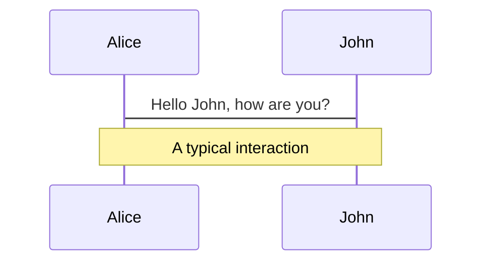

# 标题2

Hello, World!
```
console.log('aaa')
```

```ts { 2,3 }
function add(
  a: Ref<number> | number,
  b: Ref<number> | number
) {
  return computed(() => unref(a) + unref(b))
}
```
指定修改的行
```ts {2,3 | 5 }
function add(
  a: Ref<number> | number,
  b: Ref<number> | number
) {
  return computed(() => unref(a) + unref(b))
}
```


---

# 第二页标题
这是第二页

在线修改
```ts {monaco}
console.log('HelloWorld')
```


---
layout: two-cols
---


# Left

This shows on the left

::right::

# Right

This shows on the right

<!-- 这是一条备注 -->


---
theme: seriph
layout: cover
---

# Slidev

This is the cover page.


---
drawings:
enabled: true
syncAll: true
---



---

# AAAA
Hello World


